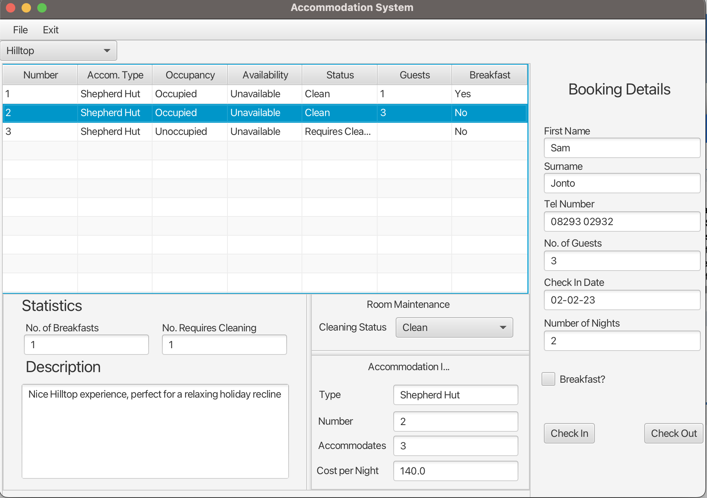
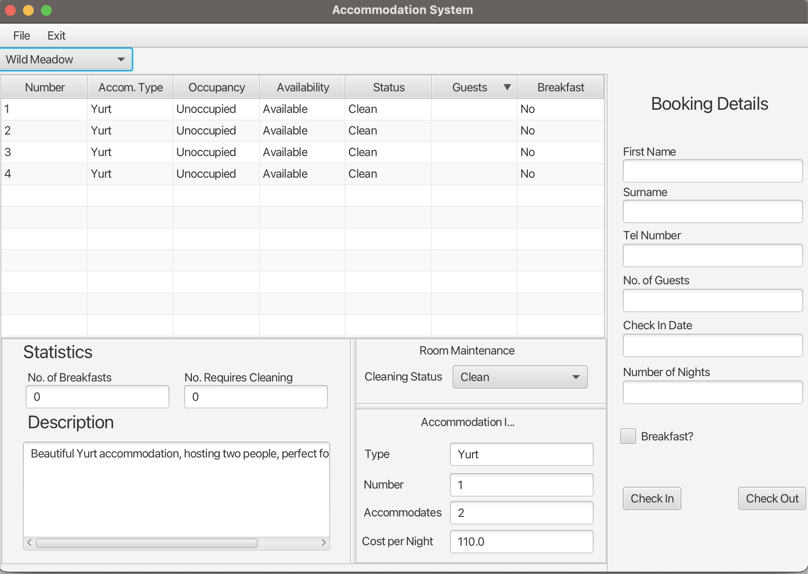
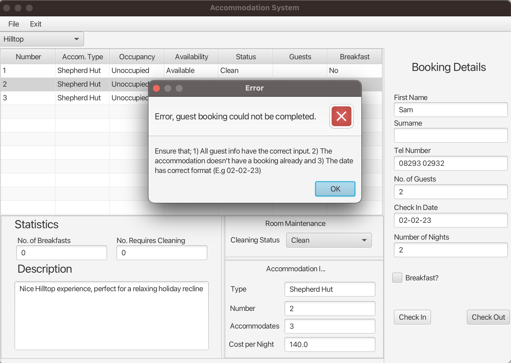

# Luxury Campsite GUI 

## Description 
GUI Application that has been designed and built for a campsite owner, to allow them to manage bookings of guests. The GUI has been conceptualised by using UML modelling, making Use-case, Class & Sequence Diagrams. After completing the diagrams to conceptualise how the classes would interact, the classes were made and implemented using JavaFX. 

## Photos
### System in use

### Homepage
First loaded when the system is ran

### Error Message
Displayed if inputs aren't matching valid types

## Features
Following an object-oriented approach, the following features were implemented.
- Modelling - (Use Case, Class & Sequence Diagrams)
- Class interface implementation - ensuring classes interact with each other
- JavaFX - making use of SceneBuilder to help conceptualise our GUI.

## Installation 
The finished product can be viewed by cloning the repo and running the 'AccommodationSystemGUI.java' file inside the 'gui' package. JavaFX will have to be installed on your own computer to allow for GUI functionality.

## Usage
The application has no database, so be cautious that any values entered will be deleted upon closing the GUI.

